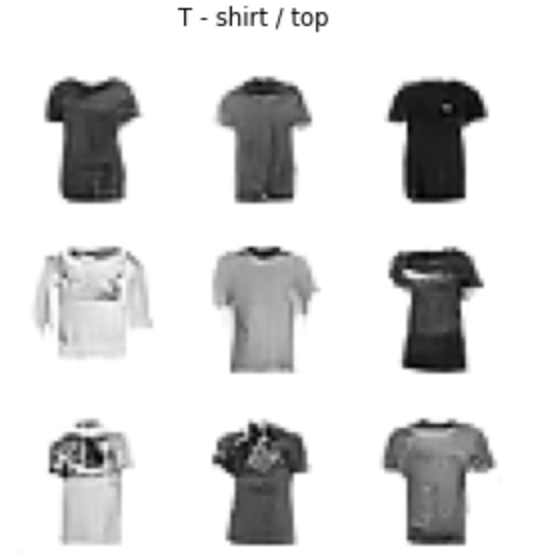
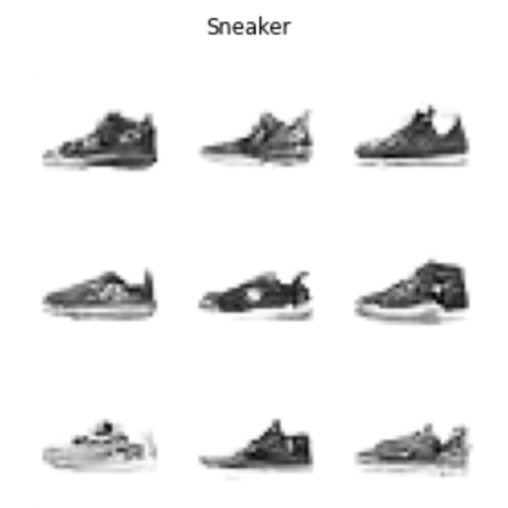

# Flow Matching
This repo contains instructions for training the flow matching model described in this blog [post](https://tommyc.xyz/posts/flow-matching).

## Setup
```commandline
pip install virtualenv
virtualenv env -p python3
source env/bin/activate
git clone https://github.com/fastai/course22p2.git
cd course22p2
```

##### update `settings.ini`
Change `pip_requirements` on line 38 in `settings.ini` to `pip_requirements = torch>=1.7 torcheval diffusers einops timm accelerate ipykernel`

##### install packages
```commandline
pip install -e .
python -m ipykernel install --user --name=env --display-name "flow_matching"
```

## Training
Open the `flow_matching.ipynb` notebook, select the `flow_matching` environment and run all cells. 

Training the flow matching model on Fashion MNIST for 5 epochs takes ~3 minutes on an A100 with 40GB of VRAM.

Here are some example images generated by the model after 5 epochs of training.

[]()
[]()
